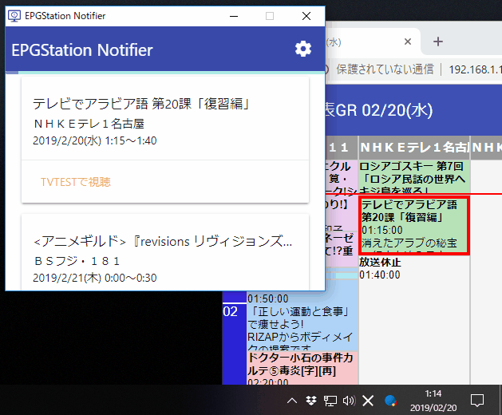
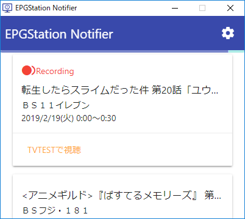
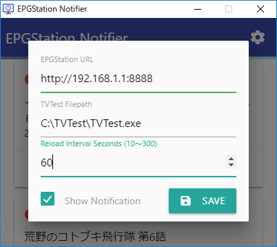

EPGStation-Notifier
====
録画管理ソフト [EPGStation](https://github.com/l3tnun/EPGStation) の通知クライアントアプリケーションです。

## 機能
- 直近24時間以内の予約一覧表示
- 放送開始5分前より通知
- アプリ内ボタンもしくは通知よりTVTestを直接起動（オプション）
- リモートのEPGStationに接続可能

## 設定項目
すべてGUIより変更可能
- 接続先EPGStationのURL
- TVTest実行ファイルのパス
- 更新間隔変更（デフォルト60秒）
- 通知機能オン・オフ

## スクリーンショット
| メイン画面 | 設定画面 |
| --- | --- |
|  |  | 

## ダウンロード
Release より最新版をDL可能

## License
[MIT License](./LICENSE)